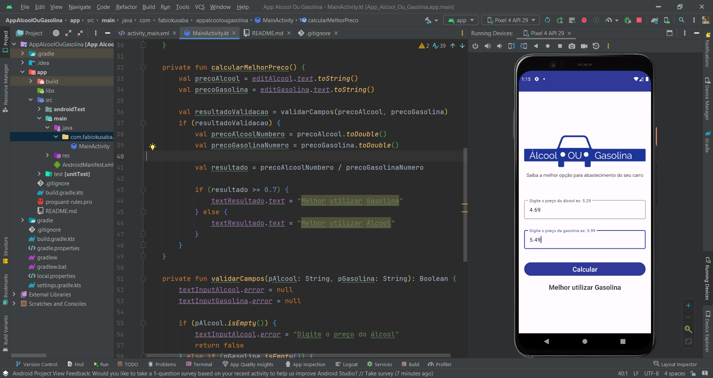

# Aplicativo para comparação de combustíveis

# Resumo
Aplicativo desenvolvido utilizando a linguagem Kotlin cujo objetivo é apresentar ao usuário qual a opção mais econômica para abastecer o seu veículo.

# Modo de usar
Para usar esta aplicação basta inserir nos campos os preços dos combustíveis na sua região, após basta clicar no botão "Calcular" e o resultado com a melhor opção aparecerá na tela.

